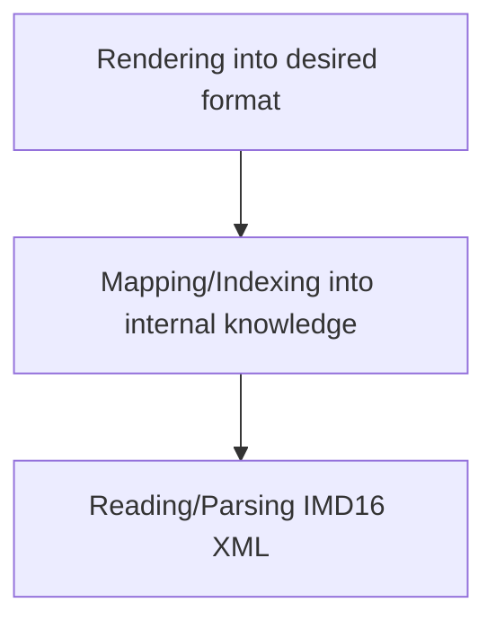

Handling of IMD16 is split into 3 levels of processing:

The following table gives an overview about current status of the implementation:

|             Name              | Features implemented | Coverage |                                                                Comment                                                                 |
|:-----------------------------:|:--------------------:|:--------:|:--------------------------------------------------------------------------------------------------------------------------------------:|
|         Reading IMD16         |   ⏳ (123/126)    |   ~97%   | All constucts out of `ilisMeta16.ili` (version 2022-04-28) can be read into Python see [Reading IlisMeta16](ilismeta16.md) |
|         Index Mapper          |    ⏳ (10/21)     |   ~48%   |                                        Ongoing DEV process see [Index Mapper](index_mapper.md)                                         |
| Python Classes (renderer) |                      |    ⏳     |                                       Demonstrator tool, see [Python Classes](python_classes.md)                                       |
|  UML Diagrams (renderer)  |     ✅ (7/7)      |   100%   |                                         Demonstrator tool, see [UML Diagrams](uml_diagrams.md)                                         |
