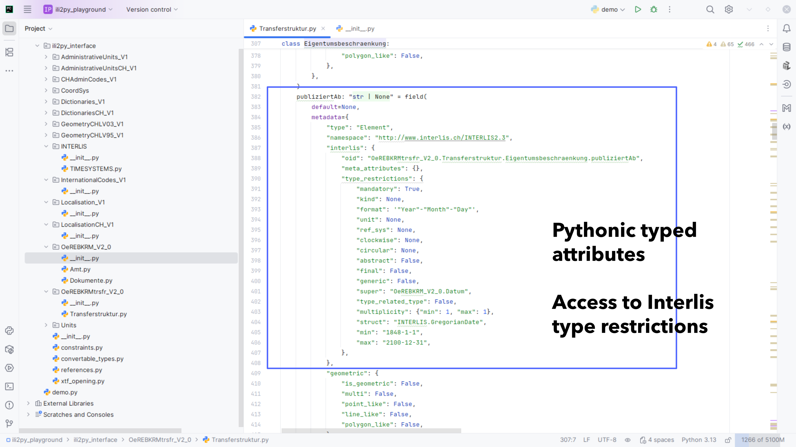

This program generates a standalone and fully typed python library from IMD16. The following section gives
an overview about the why and how.

## Intro

All started back in 2023 with some quick and dirty prototypes and lead to a [report](../documents/report/report.md).
This was backed by the cantons Neuchâtel and Basel-Landschaft.

One outcome back then was that dataclasses are the best toolset to describe data structures in python. Because it is
natively embedded and offers a wide range of flexible subsequent usage.

The idea was born to reflect the constructs of an Interlis model (ili) with those python dataclasses.

We could directly build a compiler with antlr in python to read those ili files into python structures.
Topping up only what we need one after another. That would have been the easy way.

We decided to go the hard way and implement the knowledge of the [Interlis IlisMeta16 Model](https://www.interlis.ch/modelle/metamodell) first instead.
in terms of sustainability this would be the right way to do. (And it is the dedicated usecase for the metamodel.)

## The library

The library created by **_ili2py_** is fully self containing. That means, once created it has the full knowledge of
the Interlis model and all subsequent dependencies. That is a really important point. You can use the resulting library
in your python code without any dependencies. Not even **_ili2py_** itself. The only thing you need is a python interpreter
(3.12+ recommended).

### Structure

Its structure is a normal pythonic structure. Each model is defined in a sub package (folder) of the library. Each topic is a
python module (python file) in its model folder. Domain definitions are stored in the `__init__.py` files.

### Documentation

All documentation is transparently transported to its python twins.

The inline documentation follows the widely known and used GoogleStyle which offers a supreme readability
in the code itself. But also is supported in all major IDE's out of the box.

!!! info
    Using the GoogleStyle py doc strings also enables seamless integration in automatically built documentations.

### Value lists

Value lists are implemented as pure python enumerations and are therefore perfectly prepared for native subsequent usage.

### Types

The whole library is typed. Types are self containing in the libraries network of linked dataclasses. However,
at the end of each tree path there is a native pythonic type. **No external types are used.**
Besides the types itself the library also transparently transports the information about type restrictions and formats
from the interlis model.
Associations are typed as references to keep the tree clean and avoid circular dependencies.

### Geometries

Geometries are a core feature of interlis. One goal of the built library is to give easy and comfortable access to the
geometric elements in the model. So each class can provide info about its geometric attributes. And each geometric
attribute can provide detailed information about its kind of geometry. This is a good preparation for tools which
subsequently will use **_ili2py_** later.

### Constraints

The detailed implementation of constraints is another key feature in interlis. Since **_ili2py_** does not validate
anything, constraints are only transported as information at its dedicated pythonic twin elements. The model
of the constraints mirrors the IlisMeta16 model constraints part. Classes to interpret this part are delivered in the
library as well.

### MetaAttributes

These things are often used to implement behaviour which was not intended by interlis in the first place. The information
is forwarded to each pythonic twin transparently.

