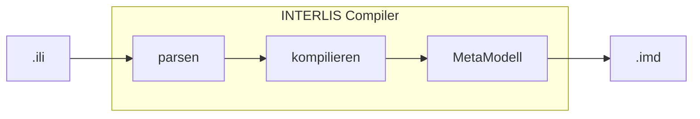

```mermaid
flowchart LR
    
    
    interlis_model[".ili"]
    subgraph ili2c["INTERLIS Compiler"]
        parsing["parsen"]
        compile["kompilieren"]
        meta_model["MetaModell"]
    end
    imd[".imd"]
    
    interlis_model-->parsing
    parsing-->compile
    compile-->meta_model
    meta_model-->imd
```