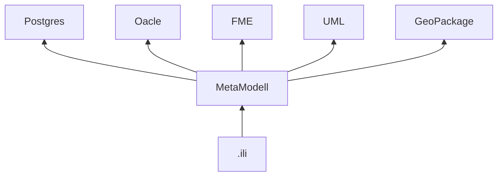

```mermaid
flowchart BT
    
    
    interlis_model[".ili"]
    meta_model["MetaModell"]
    pg["Postgres"]
    oracle["Oacle"]
    fme["FME"]
    uml["UML"]
    gpkg["GeoPackage"]
    
    interlis_model-->meta_model
    meta_model-->pg
    meta_model-->oracle
    meta_model-->fme
    meta_model-->uml
    meta_model-->gpkg
```