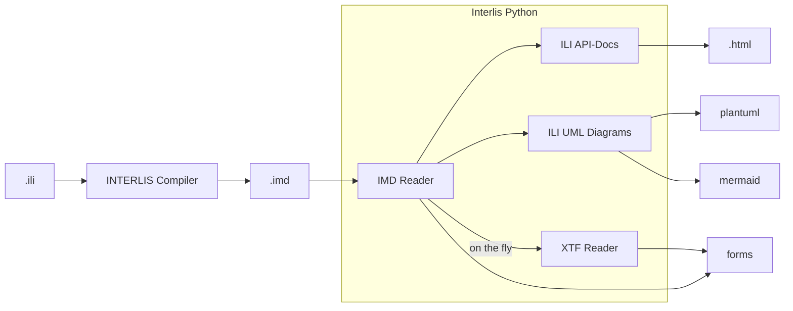

```mermaid
flowchart LR
    
    
    interlis_model[".ili"]
    ili2c["INTERLIS Compiler"]
    imd[".imd"]
    subgraph ili2py["Interlis Python"]
      imd_reader["IMD Reader"]
      xtf_reader["XTF Reader"]
      ili_docs["ILI API-Docs"]
      ili_uml["ILI UML Diagrams"]
    end
    
    interlis_model-->ili2c
    ili2c-->imd
    imd-->imd_reader
    imd_reader-->ili_docs-->.html
    imd_reader-->ili_uml-->plantuml
    ili_uml-->mermaid
    imd_reader-->|on the fly|xtf_reader-->forms
    imd_reader-->forms
```