<!-- color: gray -->

# Python Bindings for INTERLIS

---

# INTERLIS

- DER *systemunabhängige* Standard in der CH für digitale (Geo)Daten
- Modellieren UND Programmieren
- Wozu ein Datenmodell ohne Software?
- INTERLIS ist *immer weniger* nur Austauschformat
- lebendiger Beweis für diese Thesen sind die Werkzeuge

---

# Aktuelle Situation Werkzeuge

- [Eisenhut ilitools](https://github.com/claeis) => JAVA
- [ilic](https://github.com/infogrips/ilic) => C++/JAVA
- [QGIS Model Baker](https://github.com/opengisch/QgisModelBaker) => QGIS/JAVA/DB
- [Syntax-Highlighting und Autocompletion](https://marketplace.visualstudio.com/items?itemName=geowerkstatt.InterlisLanguageSupport)
- diverse Fachapplikationen und Insellösungen

---

# Der Goldstandard

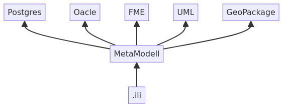

---

# Der INTERLIS Compiler

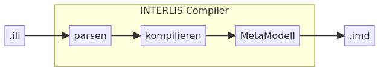

---

# Ziele

- Programmiersprache Python
- generisches Verständnis von INTERLIS
- Aufbau von Workflows (Bibliotheken) zur Erweiterung der Nutzerbasis

---

# Nicht das Ziel

- Neu programmieren was schon existiert (außer es erscheint sinnvoll...)

---

# Gegenüberstellung

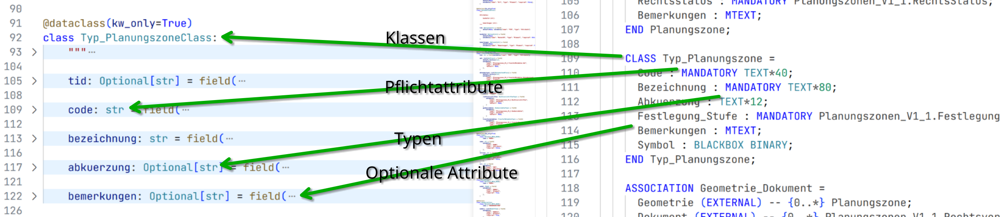

---

# Entscheidungen/Abkürzungen für den POC

* kein ili-Parsen/Kompiling (ili2c macht das gut)
* Python dataclasses als Datenstrukturen
* So viel wie nötig für halbwegs praktische Beispiele

---

# Metamodell

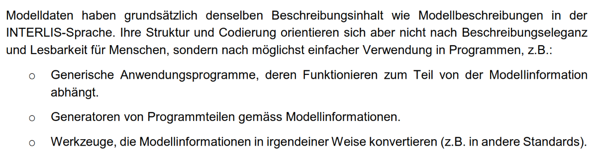

[Quelle: INTERLIS 2 – Metamodell ](https://www.interlis.ch/download/interlis2/ili24-metamodel_2022-06-17_d.pdf)

---

# Metamodell

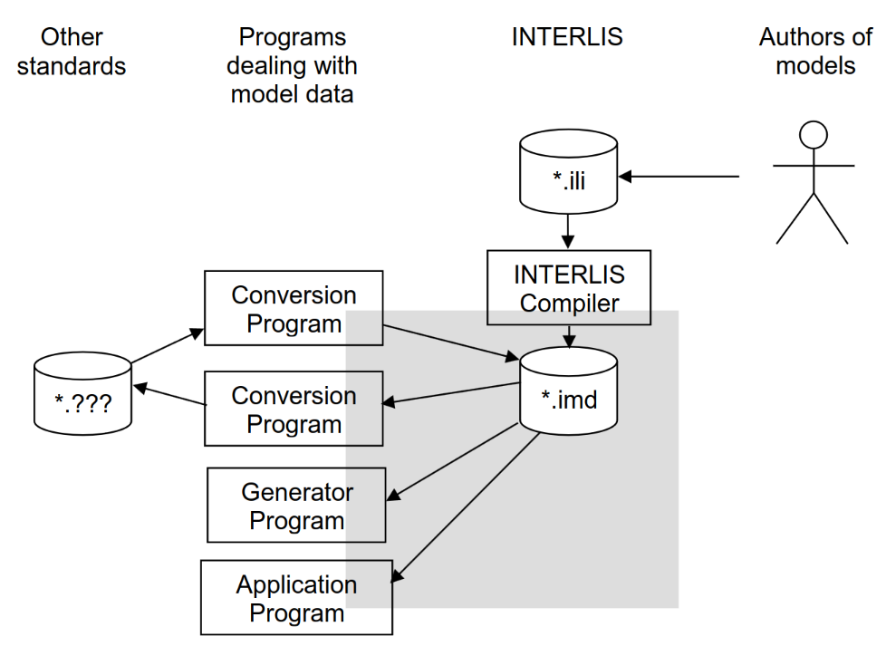

[Quelle: INTERLIS 2 – Metamodell ](https://www.interlis.ch/download/interlis2/ili24-metamodel_2022-06-17_d.pdf)

---

# Potentieller Weg

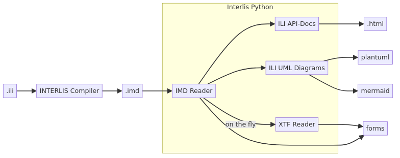

---

# Beispiel 1 - IMD/ILI verstehen

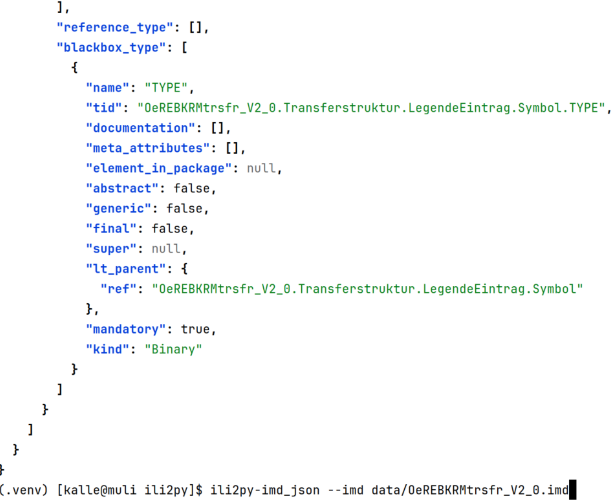

---

# Beispiel 2 - XTF modellkonform lesen

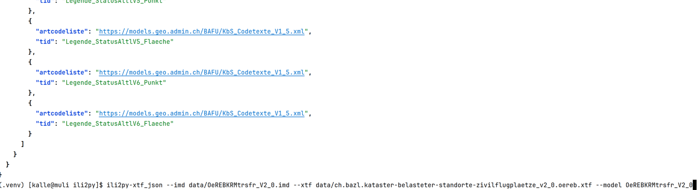

---

# Beispiel 3 - IMD/ILI verstehen und Python Code ableiten

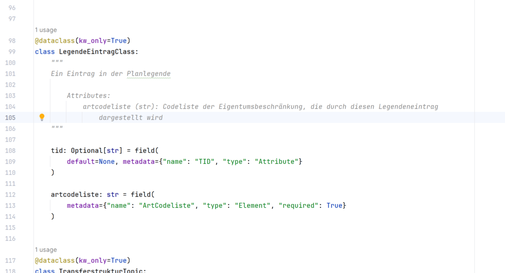

---

# Beispiel 4.1 - IMD/ILI verstehen und UML ableiten

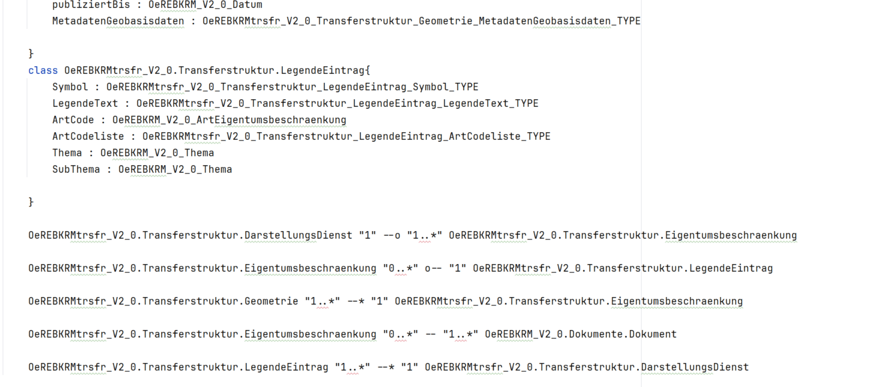

---

# Beispiel 4.2 - IMD/ILI verstehen und UML ableiten

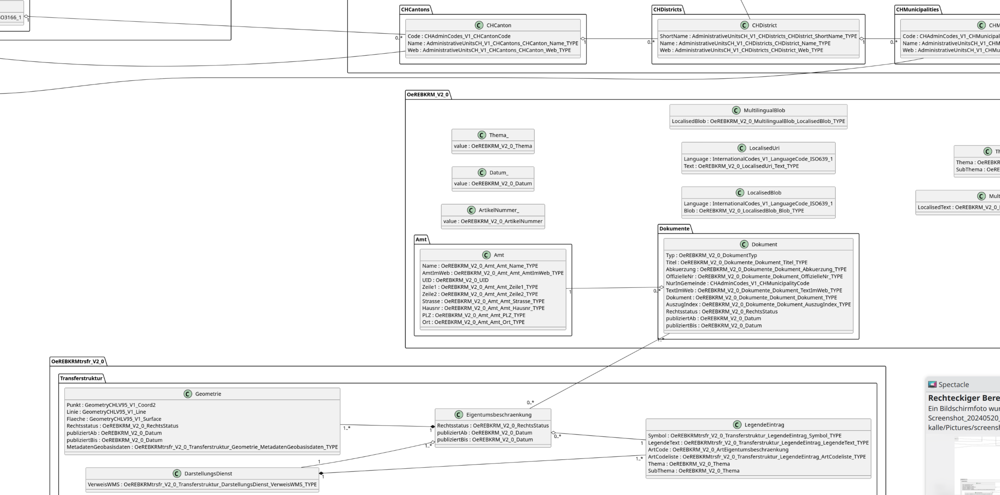

[(UML OeREBKRMtrsfr_V2_0)](../../data/OeREBKRMtrsfr_V2_0.svg) [(UML Planungszonen_V1_1)](../../data/Planungszonen_V1_1.svg) [(UML SO_AFU_ABBAUSTELLEN_Publikation_20221103)](../../data/SO_AFU_ABBAUSTELLEN_Publikation_20221103.svg)

---

# Zusammenfassung

- POC skizziert die Möglichkeiten
- sehr positiver Ausgang
- gewünschte Beispiele konnten erstellt werden
    - beliebiges ILI/IMD lesen => JSON (mgl. Ziel: OPENAPI, JSON Schema Definition)
    - beliebiges XTF + ILI/IMD lesen => JSON (mgl. Ziel: dynamisch erzeugte generische Reader, um XTF zu lesen)
    - beliebiges ILI/IMD lesen => Pyton (dataclasses) ausgeben (mgl. Ziel: Validierung von Formularen, Editor-Syntax Highlighting + Autocomplete, Basisbibliothek für Fachapplikationen)

---

# Ausblick

- Finanzierung
- MVP
- Roadmap
- Projektorganisation
