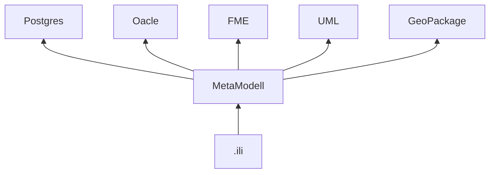
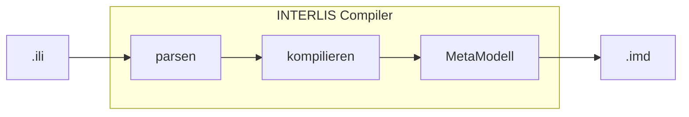
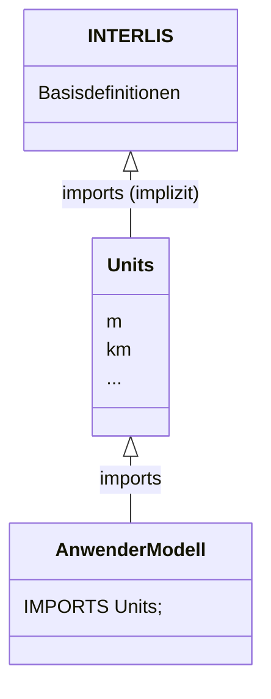

# Python Bindings für INTERLIS

## Zusammenfassung

Vorliegender POC skizziert die Möglichkeiten anhand von INTERLIS-Modellen Pythonstrukturen abzuleiten. Diese
Strukturen sollen genutzt werden um nativ in der Programmiersprache Python Applikationen aufbauen zu können.
Vordringlichstes Ziel ist die Verbreiterung der Anwenderbasis. Python ist heute eine der am weitesten verbreiteten
Programmiersprachen und besonders im Opensource-Umfeld nicht wegzudenken.

Dieser POC nutzt bewusst bereits vorhandene Mechanismen mit denen INTERLIS vom abstrakten Datenmodell in
die praktische Welt der Programmierung zu heben. Das Metamodell. Es wurde genau zu diesem Zwecke geschaffen.
So ist der Ausgangspunkt für alle hier gezeigten Beispiele immer das Metamodell (imd) des jeweiligen
INTERLIS-Modells (ili). Die Erstellung des jeweiligen Metamodells übernimmt in diesem POC die Software `ìli2c`.

Der Ausgang dieses POCs ist positiv. Alle gewünschten Anwendungsfälle konnten belegt werden. Auf dieser Basis
kann nun eine neuerliche Diskussion über die weiteren Ziele geführt werden.

Folgende Anwendungsfälle wurden implementiert:

- beliebiges Metamodell lesen und dessen Definition als JSON ausgeben (mgl. Ziel: OPENAPI, JSON Schema Definition)
- beliebiges XTF seinem Modell nach lesen und dessen Inhalt als JSON ausgeben (mgl. Ziel: dynamisch erzeugte generische Reader, um XTF zu lesen)
- beliebiges Metamodell lesen und dessen Definition als Pyton-Code (dataclasses) ausgeben (mgl. Ziel: Validierung von Formularen, Editor-Syntax Highlighting + Autocomplete, Basisbibliothek für Fachapplikationen)

## Einführung

INTERLIS ist in der Schweiz eine der wichtigsten (und vom Bund vorgeschriebene) Modellierungssprache für viele
digitale (Geo)Daten. An dieser Stelle sollen dem Leser die Details der Theorie erspart bleiben und einfach
nur auf die umfangreichen Referenzhandbücher verwiesen werden.

Wichtige Punkte zum Verständnis dieses Konzepts werden hier kurz erläutert. Es wird jedoch erwartet, dass eine
gewisse Vorbildung zum Thema besteht. Auch wenn mit diesem Text kleinere praktische Elemente erläutert werden
geht es doch vorerst noch darum technisch, philosophisch auf einen Nenner mit dem Leser zu kommen. Es sollen
wichtige technische Grundbegriffe beleuchtet werden.

### Einordnung

INTERLIS wird immer als einer unabhängigen Modellierungssprache, vorrangig für Geodaten, inzwischen aber auch
darüber hinaus gehandelt. Das ist korrekt. Die intuitive *Sprache* lässt aber schnell vergessen, dass
man sich in der digitalen Welt bewegt und das, was man *Modellieren* nennt, eigentlich
*Programmieren* ist. Dem interessierten Leser sei an dieser Stelle das Studium der Programmiersprache
[Modula-2](https://en.wikipedia.org/wiki/Modula-2) ans Herz gelegt. Sie ist es die man schreibt, wenn man 
INTERLIS schreibt. Natürlich mit Erweiterungen, aber im Kern ist es Modula-2. Wir programmieren also wenn wir
modellieren! Man könnte dieselben Resultate
erreichen wenn man die Klassen und Assoziationen einfach in JAVA oder PYTHON schreiben würde. Bis auf ein
Detail: INTERLIS bildet die Grundbausteine ab, die in jeder halbwegs modernen Programmiersprache heutzutage zu
finden sind und ist deshalb universell. Das heisst, es lässt sich ohne Probleme in Konstrukte der Wahlsprache
übersetzen. Und das ist eine der wichtigsten Fähigkeiten von INTERLIS. Die, die wir nutzen wollen. Denn, wozu
ein Datenmodell, wenn man keine Software dafür hat?

Wenn wir nun also beim Modellieren programmieren sollten wir unsere Werkzeuge, Arbeitsabläufe, Praktiken und
Verwaltungsansätze auch den Entwicklungen der Zeit annähern. Versionsverwaltung, Packagemangement,
Releasemanagement, Codingsupport, automatische Generierung von Dokumentation, all das sind verglichen mit
INTERLIS eher neuere aber nicht weniger wichtige Erfindungen in der IT.

Man könnte nun sagen, INTERLIS sei reines Austauschformat. Also ein Vertrag zwischen Datenlieferant und
Datenempfänger, welcher in aller Tiefe den Inhalt definiert. Als solches wird es auch vorrangig genutzt.
Allerdings hat die Praxis wie immer auch ihre eigenen Blüten neben der Theorie getrieben und INTERLIS wird eben
nicht nur mehr zur Definition im Datenaustausch genutzt, sondern auch zur Definition von Erfassungsmodellen,
Darstellungsmodellen (Strukturen optimiert für das grafische Rendering der Daten) oder applikationszentrischen
Modellen (z.B.: ÖREB). Schnell wird neben dem Anwendungsfall die Daten zu senden und zu empfangen, das bedeutet
eigentlich Datenbankexport und Datenbankimport, auch eine Applikation mit Logik auf INTERLIS Strukturen aufgebaut
die über den ursprünglichen Anwendungszeck hinausgehen. Werkzeuge wie die verschiednen ÖREB-Server Umsetzungen,
Versuche Texteditoren mit
[Syntax-Highlighting und Autocompletion](https://marketplace.visualstudio.com/items?itemName=geowerkstatt.InterlisLanguageSupport)
auszustatten oder auch [Model Baker](https://github.com/opengisch/QgisModelBaker) sind
lebendige Beweise dieser These.

### Software

Die folgenden Betrachtungen beziehen sich auf OpenSource Software. Sie sind nicht ausgrenzend oder
abschliessend und orientieren sich an dem Ökosystem welches dem Autor in seinem täglichen Umgang mit dem Thema
bekannt ist.

Wovon reden wir also, wenn es um die Software geht? Heute gibt es neben diversen Fachschalen nur EINE Sammlung
von Werkzeugen, die sich mit der generischen Nutzung von INTERLIS im Applikationsumfeld auseinandersetzt:

Die [Ilitools](http://www.eisenhutinformatik.ch/interlis/) der Eisenhut Informatik AG

Sie sind seit Jahren *first-class-member* der INTERLIS-Welt und können wohl als der Goldstandard
hinsichtlich Umsetzung, Generik und dem Verständnis der Materie gelten. Dies gilt nicht nur für JAVA sondern
die Designentscheidungen welche hier getroffen wurden sind unabhängig von der Zielsprache als universell zu
betrachten.

### Funktionsüberblick ilitools

Auf der Webseite werden diese Werkzeuge als Schnittstellen bezeichnet. Und das sind sie. Nicht mehr und nicht
weniger. Wenn wir das Umfeld anschauen und es grob vereinfachen gruppieren sie alle sich um einen Kern.
Dem [Metamodell](https://www.interlis.ch/modelle/metamodell). Es ist die abstrakte Beschreibung der
INTERLIS-Sprachelemente. Ihr Zweck ist die Übersetzung von *.ili* Dateien in die Sprache/Elemente des
jeweiligen Zielsystems.



Statt also für jedes Modell eigene Software schreiben zu müssen, führt die Abfolge der Arbeitsschritte über
die generische Schicht ins Zielsystem. Das Kompilieren des *.ili* Modells in das Metamodell
erfolgt durch JAVA und im Prozess innerhalb von JAVA Code. Der Nutzer merkt bei den ilitools davon nichts.
Intern wird aber nach dem Bauplan des Metamodells ein ineinander verschachteltes Konstrukt aus (Java) Klassen,
sozusagen Programmierung-on-the-fly, erzeugt.
Dieses standardisierte Konstrukt wird dann innerhalb der jeweiligen spezifischen Ausprägung
(z.B.: [ili2pg](http://www.eisenhutinformatik.ch/interlis/ili2pg/)) genutzt um Operationen auszuführen.
In unserem Beispiel eben dann, um mittels SQL dem Modell entsprechende Datenbankstrukturen zu erstellen.
Mittels [INTERLIS Compiler (ili2c)](https://www.interlis.ch/downloads/ili2c) kann der "versteckte"
Schritt für den Nutzer "sichtbar" gemacht werden. Es wird eine *.imd* Datei erzeugt. Diese
ist eigentlich eine INTERLIS Transferdatei, also ein XML und enthält den universellen Bauplan des kompilierten
Modells.



INTERLIS ermöglicht in einem Modell Elemente aus einem anderen Modell zu nutzen (*IMPORTS*). Dies ist
ein wichtiger Baustein, der zum Erfolg des Systems beiträgt. Diese Art Verkettung bedeutet aber, dass zum
Kompilierungszeitpunkt die komplette Kette an Informationen zur Verfügung stehen muss.



Dieser Punkt ist für die späteren Diskussionspunkte wichtig und aus diesem Grunde hier nur stark verkürzt
und fast schon unzulässig vereinfacht dargestellt. Die ilitools übernehmen dies Aufgabe aber. So ist der Inhalt
eines kompilierten Metamodells immer der Inhalt der kompletten Kette - Ein wichtiges Detail.

### Flexibilität

Aus Sicht eines JAVA-Entwicklers dürften nun alle wichtigen Informationen klar sein. Ein neues Zielsystem
bedeutet ein neues ili2XXX Werkzeug. Der Vielfalt sind keine Grenzen gesetzt. Solange wir uns im JAVA-Umfeld
bewegen ist die Geschichte wahr. Und darüber hinaus auch in die eine oder andere Richtung vielleicht auch noch
weiter. Will man aber die domainspezifischen Informationen, die üblicherweise in einem INTERLIS-Modell stecken
in anderen Programmiersprachen nutzen, wird es schnell dünn. Über Umwege können wir diese Information
transportieren. Klassisch wäre hier der Import von Modell und Daten in eine relationale Datenbank und aufbauend
auf dieser dann die Extraktion der Modellinformationen. Doch halt. Wir haben hier einen Transformationsschritt,
bei dem Informationen verloren gehen. Darüber hinaus müssen beim Wechsel vom Objektraum (INTERLIS-Modell) in
den relationalen Raum (Datenbank) Kompromisse eingegangen werden. Dies verhindert, dass ein Programm welches
seine Informationen aus der resultierenden Datenbank bezieht nicht die *Wahrheit* des ursprünglichen
Modells kennen kann. In der Praxis behilft man sich mit allerhand Feenstaub und das funktioniert auch meistens.
Ein paar Metaattribute hier, ein bisschen Kommentarprogrammierung dort. Letzen Endes sind das aber alles teils
spezifische Lösungen und nicht vom Charakter wie wir ihn von einem generischen Software-Ansatz erwarten.
Flexibel und systemunabhängig sind wir aktuell im INTERLIS-Umfeld nur in der JAVA-Welt. Don't state the
obvious. Egal ich tue es trotzdem. DAS IST EIN WIDERSPRUCH IN SICH!

Natürlich können wir aus JAVA heraus allerhand Spielereien machen. Wir können JAVA in Container packen, wir
können mit JAVA Python ausführen. Aber wirklich nativ in der jeweiligen Programmiersprache und mit den ihr
zugehörigen Bordmitteln optimalen Code produzieren. Das können wir so nicht. Wir sind unflexibel. Wir sind nicht
frei in der Wahl unserer Werkzeuge.

## Ziele

Bevor wir an die weitere Analyse gehen, möchte ich über die Ziele sprechen die verfolgt werden. Im Wesentlichen
sind diese in diesem [Blogbeitrag](https://www.opengis.ch/de/2023/11/24/python-bindings-fuer-interlis/) (bitte lesen!) hinreichend
erläutert. Zusammenfassend:

- Zielsprache Python
- Unterstützung von INTERLIS nativ und generisch (keine Programmierung pro ILI)
- Aufbau von Workflows zum Aufzeigen des Nutzens

## Ansätze

Nach diesem kurzen Rundumschlag sind wir mit den wichtigsten Inhalten vertraut, um uns in die Diskussion der
möglichen Ansätze zu begeben.

### INTERLIS-Modell SourceCode parsen

Wir haben gesehen, dass die ilitools am Beispiel des INTERLIS Compilers zuerst das INTERLIS-Modell lesen
(den SourceCode) und dann aus ihm das Metamodell kompilieren.

Der Schritt des Lesens und des "Verstehens" ist
universell in jeder Programmiersprache und findet beinahe überall Anwendung. Textdateien werden in
Maschinencode übersetzt. Mit der Erkenntnis, dass uns das Metamodell erlaubt modular beliebige Fachapplikationen
darauf aufzubauen werden wir mit einiger Voraussicht feststellen, dass auch wir bei einem ähnlichen Ansatz landen
würden. Diesen Prozess also in Python nachzubauen, würde uns vorerst nicht dem eigentlichen Ziel näher bringen.
Zu gewinnen wären lediglich programmiersprachenspezifische Optimierungen. Diese können wir aber auch auf anderen
Ebenen unseres Zielsystems implementieren. Insofern liegt es nahe, diesen Schritt vorerst einfach zu übernehmen. Und ab
fertigem Metamodell zu starten. Doch wie schaffen wir den Sprung vom in JAVA kompilierten Metamodell nach Python?
Auch hier nehmen wir vorerst die Abkürzung. Statt direkt über JAVA zu gehen, nutzen wir die *.imd* Datei, die
wir mit ili2c aus jedem Modell erzeugen können als Ausgangspunkt.

### *Rücke vor bis auf Los*

Oben beschriebene Abkürzung lässt uns nun lediglich folgende Aufgabe zu tun: Wir müssen einen XML-Parser bauen
der das *.imd* lesen kann und daraus per Programmierung-on-the-fly Python-Strukturen erzeugt, welche wir dann
weiternutzen können.

## Python-Strukturen

Wenn es darum geht Daten in Python zu repräsentieren, hat man die Qual der Wahl. Daten? Ja, denn aus unserer
Perspektive sind sowohl die Metamodelle, die wir mit `ili2c` erzeugen wie auch die XTF einfach nur Daten.
 Mit dem kleinen Unterschied, dass und das jeweilige Metamodell den Bauplan liefert die Struktur des korrespondierenden
XTF zu "verstehen". Letzten Endes haben wir mit
dem Metamodell eigentlich alle Stricke in der Hand um vollkommen in purem Python Code zu implementieren. Das
führt aber hier schnell zu Fragestellungen die bereits in beliebiger Tiefe durch die Python Community behandelt
wurde. Der folgende Abschnitt soll aufzeigen welche Ansätze wir haben, um Daten in Python abzubilden.

### Anforderungen

Datenstrukturen in Python meint Daten in Objektform. Das heisst wir verzichten an dieser Stelle auf die Betrachtung
von ORMs wie [SQLAlchemy](https://www.sqlalchemy.org/) oder
[Django Models](https://docs.djangoproject.com/en/5.0/topics/db/models/). Das könnten allenfalls Zielestrukturen
sein welche man in nachgeordneten Ebenen des Prozesses anstrebt. Ziel muss ein möglichst generische doch optimierte
Repräsentation des INTERLIS-Modells sein, um die Anwendung in einem breiten Umfeld möglich zu machen. Doch möchte
man nicht auf spezifische Funktionalitäten verzichten. Besonders sind dies allenfalls bereits vorhandene Möglichkeiten zum:

- De-/Serialisierung von Objekten
- Dokumentation
- Validierung nach vorgegebenen Regeln
- Präzisions bzw. Rundungsregeln (`0.00 .. 10.00` vs. `0.000 .. 10.000`)
- Vergleichbarkeit von Objekten

### Basis

Python unterstützt das Paradigma der objektorientierten Programmierung und liefert uns damit alle Werkzeuge,
die wir benötigen, um das Metamodell in Python abzubilden. Auf Details wird in der POC Implementierung
eingegangen.

Zum besseren Verständnis nutzen wir ein einfaches [Beispielmodell](example/example.ili). Es beinhaltet einige
INTERLIS-Definitionen anhand derer wir alles Weitere nachvollziehen können.

In welche Richtung es gehen könnte, lässt sich in der [Pseudoimplementierung](example/example.pseudo.py) gut
sehen. Wir repräsentieren Elemente aus INTERLIS in korrespondierende Gegenstücke in Python. Am gezeigten
Beispiel wird ersichtlich, welchen Umfang eine saubere Ableitung annehmen würde. Zumal längst nicht alle
Inhalte im Beispiel berücksichtigt sind.

### Ein neues Rad

Würde man dem oben beschriebenen Weg folgen, entstünde ein sehr umfangreicher Satz an Python Code.
Schnell kommt man an den Punkt, an dem man sich fragt, ob nicht jemand schonmal an demselben Problem saß und
ob es nicht bereits gelöst sein könnte. Nochmal kurz benannt.

**Was ist das Problem?**

*Abbildung von Datenstrukturen in Python.*

Natürlich wurde dieses Thema im Pyhton-Umfeld behandelt. Aus meiner Sicht stehen 3 Wege offen diesem Problem
zu begegnen:

- [dataclasses](https://peps.python.org/pep-0557/)
- [attrs](https://www.attrs.org/en/stable/index.html)
- [pydantic](https://docs.pydantic.dev/latest/)

Es gäbe bestimmt noch weitere Möglichkeiten aber wir belassen es bei diesen, da wir keine Python-Package
Rundschau betreiben, sondern an einer Lösungsskizze arbeiten wollen.

#### dataclasses

PRO:

- nativ in Python seit 3.7[*]
- Verhalten wie einfach Klassen
- Vergleich von Objekten (`field(compare=True)`)
- einfacher @Decorator um eine Pythonklasse zu einer dataclasses Klasse zu machen
- Validierung mit eigenen Routinen möglich (Zeitpunkt klar)
- gutes stdout print

CONTRA:

- Datenvalidierung umständlich (z.B. via `__post_init__` Funktion) und erst nach Objektinitialisierung
- Konvertierung zwischen verschiedenen Datatypes
- Funktionsumfang hängt an der Pythonversion

*(für den POC werden Funktionen ab Python 3.11 verwendet (`ENUM`))

#### attrs

PRO:

- Vergleich von Objekten besser steuerbar (`field(eq=str.lower)`)
- Validierung mit eigenen Routinen möglich und einfach über `field` oder `@<Attributname>.validator` zuordenbar
- Validierungszeitpunkt klar
- einfacher @Decorator um eine Pythonklasse zu einer attrs Klasse zu machen
- gutes stdout print

CONTRA:

- Biliothek muss installiert werden (zusätzliche Abhängigkeit)
- nicht verpflichtend hinsichtlich Typing

#### pydantic

PRO:

- Datenvalidierung bereits eingebaut (`email`, `numbers`, `uris`, etc.)
- ist die Basis für viele Bibliotheken (DJango Ninja API, FastAPI, etc.)

CONTRA:

- Biliothek muss installiert werden (zusätzliche Abhängigkeit)
- Vererbung von `BaseModel` führt spezielles Verhalten der Klasse ein weg von einer Standardklasse
- kein Vergleich von Objekten
- Validierungszeitpunkt nicht klar (Objektinstanzierung, Wertänderung, etc.)
- mässiges stdout print

### Entscheide

Die vorherigen kurzen Betrachtungen legen vorerst die Wahl von dataclasses nahe. So werden die Showcases auf
dieser Basis umgesetzt. Hauptgrund ist die native Unterstützung seit Python 3.7 (bzw. mit Enumerations 3.11).

Die rundum komplexe Thematik des INTERLIS Metamodells lässt eine abschliessende Umsetzung in der Kürze des
POCs nicht zu. Aus diesem Grunde wird aus dem Metamodell nur umgesetzt, was wirklich für Demonstrationszwecke
nützlich ist. Das ist trotzdem sehr umfangreich. Insbesondere bei den Attributtypen beschränkt sich der POC
auf die Typen TextType, NumType und das Basisverständnis von Klassen, Topics sowie Attributen. Auch wenn
die umgesetzte Lösung bereits die Vererbung kennt, ist diese im aktuellen POC nur rudimentär umgesetzt. Es
gehört also nicht zum aktuellen Funktionsumfang innerhalb von INTERLIS-Modellen die Vererbung zwischen Klassen
zu verfolgen.

### Anregung für künftige Diskussionen

Für den POC wurde die Wahl getroffen. Für eine Umsetzung hin zu einer wirklichen Bibliothek vom Charakter
ähnlich den ILI-Tools muss dennoch über die Implementierung auf den einfachen Konstrukten
aus Python OOP nachgedacht werden. Nur so macht man sich möglichst unabhängig von Versionen und
externen Bibliotheken. Die Bausteine unserer angestrebten Lösung sind im Wesentlichen Funktionen,
Klassen, Assoziationen und XML lesen/schreiben. Auf diese Basisfunktionen können dann beliebige
Lösungen aufgesetzt werden. Doch das ist nicht Entscheidung des vorliegenen POC's, sondern muss in
einer größeren Runde von künftigen Anwendern diskutiert werden.

## XML und Python

Beim Umgang mit INTERLIS muss unweigerlich das Problem des Datenparsens gelöst werden. Üblicherweise wird in
Python dazu [lxml](https://lxml.de/tutorial.html) verwendet. Diese Biblothek liegt fast allen anderen
Anwendungen zugrunde. Es handelt sich jedoch um eine Basisbibliothek und der Umgang mit ihr ist umständlich.

Da wir uns bereits für dataclasses entschieden haben und das Metamodell bekannt ist, können wir aus Zeitgründen
eine etwas höhere Abstraktionsebene zum Parsen wählen. Hier setzen wir auf
[xsdata](https://xsdata.readthedocs.io/en/latest/). Dieses Werkzeug bietet uns nicht nur die Möglichkeit XML
nach einer vorher in dataclasses definierten Struktur und damit metamodellkonform zu parsen, sondern erzeugt
uns auch gleich die korrespondierenden Objekte aus den dataclasses. Damit können wir dann im Python nativ
arbeiten. Insgesamt spart das zwar Zeit, aber es ist auch keine unzulässige Abkürzung. Der vorgestellte Ansatz
funktioniert auch ohne xsdata. Explizit wurde nicht der Teil von xsdata genutzt um ein Modell aus XML oder aus
XSD zu erzeugen. Die vorliegende Umsetzung bildet, soweit fortgeschritten, das Metamodell nach dem ILI und
der zugehörigen semantischen Beschreibung im PDF ab. xsdata wird nur zum Parsen der imd XML Dateien und der XTF
Dateien genutzt.

## Demonstration

Die Auswahl der hier erwähnten Modelle und Daten erfolgte zufällig aus einem Fundus der lokal zur Verfügung
stand. Der vorgestellte Ansatz ist universeller Natur. Dennoch muss unbedingt mit Problemen gerechnet werden,
wenn andere Modell-/Datenkombinationen ausprobiert werden. Zusätzlich sei nochmal erwähnt, dass aktuell nur
Attributtypen TextType und keine Assoziationen umgesetzt sind. Das heisst, dass je nach Modell das Resultat
ziemlich dünn erscheint.

### Beispiel 1

Es soll gezeigt werden, dass wir mit vorliegender Technik in der Lage sind, beliebige imd's zu lesen und dem
Modell nach zu verstehen. Es werden Pythonstrukturen gemäss Metamodell erzeugt. Dies ist ein zentraler
Bestandteil des Konzepts. Wohlgemerkt wird hier nicht einfach xml => json umgewandelt.

Liest das [OeREBKRMtrsfr_V2_0](data/OeREBKRMtrsfr_V2_0.ili) Modell und gibt den Inhalt als JSON aus:

```shell
ili2py-imd_json --imd data/OeREBKRMtrsfr_V2_0.imd
```

Liest das [SO_AFU_ABBAUSTELLEN_Publikation_20221103](data/SO_AFU_ABBAUSTELLEN_Publikation_20221103.ili) Modell und gibt den Inhalt als JSON aus:

```shell
ili2py-imd_json --imd data/SO_AFU_ABBAUSTELLEN_Publikation_20221103.imd
```

Liest das [Planungszonen_V1_1](data/Planungszonen_V1_1.ili) Modell und gibt den Inhalt als JSON aus:

```shell
ili2py-imd_json --imd data/Planungszonen_V1_1.imd
```

## Beispiel 2

Es soll gezeigt werden, was mit dem *verstandenen* Datenmodell aus Beispiel 1 alles gemacht werden kann. Es
wird anhand des Modells dynamisch ein Reader erzeugt, der in der Lage ist, ein XTF zu lesen welches zum Modell
passt. Das bedeutet, wann immer man das Modell und die Daten hat, muss man keinen modellspezifischen Code mehr
schreiben. Dieser wird zur Laufzeit erzeugt und zum Lesen der Daten verwendet.

Liest Daten aus einem XTF nach [OeREBKRMtrsfr_V2_0](data/OeREBKRMtrsfr_V2_0.ili) Modell und gibt den Inhalt als JSON aus:

```shell
ili2py-xtf_json --imd data/OeREBKRMtrsfr_V2_0.imd --xtf data/ch.bazl.kataster-belasteter-standorte-zivilflugplaetze_v2_0.oereb.xtf --model OeREBKRMtrsfr_V2_0
```

Liest Daten aus einem XTF nach [SO_AFU_ABBAUSTELLEN_Publikation_20221103](data/SO_AFU_ABBAUSTELLEN_Publikation_20221103.ili) Modell und gibt den Inhalt als JSON aus:

```shell
ili2py-xtf_json --imd data/SO_AFU_ABBAUSTELLEN_Publikation_20221103.imd --xtf data/ch.so.afu.abbaustellen.xtf --model SO_AFU_ABBAUSTELLEN_Publikation_20221103
```

Liest Daten aus einem XTF nach [Planungszonen_V1_1](data/Planungszonen_V1_1.ili) Modell und gibt den Inhalt als JSON aus:

```shell
ili2py-xtf_json --imd data/Planungszonen_V1_1.imd --xtf data/ch.Planungszonen.sh.mgdm.v1_1.xtf --model Planungszonen_V1_1
```

## Beispiel 3

Neben der dynamischen Erstellung eines modellkonformen Readers und dessen Nutzung ist die Persistierung
des Codes ein anderer wichtiger Anwendungsfall. In diesem Beispiel soll gezeigt werden, dass wir mit unserem
Ansatz in der Lage sind Pythonstrukturen erzeugen zu kommen welche wir später in Fachapplikationen einsetzen
können. Ein denkbarer Anwendungsfall wäre hier die Erstellung eine API (CRUD/REST/OPENAPI) auf Basis des
jeweiligen Modells. Oder aber direkt eine Formularlösung (Django Forms o. ä.). Alle Beispiele schreiben in
eine Pythondatei.

Liest das [OeREBKRMtrsfr_V2_0](data/OeREBKRMtrsfr_V2_0.ili) Modell und gibt den Inhalt als Python Code aus:

```shell
ili2py-xtf_reader_classes --imd data/OeREBKRMtrsfr_V2_0.imd --model OeREBKRMtrsfr_V2_0 > data/OeREBKRMtrsfr_V2_0.py
```

Liest das [SO_AFU_ABBAUSTELLEN_Publikation_20221103](data/SO_AFU_ABBAUSTELLEN_Publikation_20221103.ili) Modell und gibt den Inhalt als Python Code aus:

```shell
ili2py-xtf_reader_classes --imd data/SO_AFU_ABBAUSTELLEN_Publikation_20221103.imd --model SO_AFU_ABBAUSTELLEN_Publikation_20221103 > data/SO_AFU_ABBAUSTELLEN_Publikation_20221103.py
```

Liest das [Planungszonen_V1_1](data/Planungszonen_V1_1.ili) Modell und gibt den Inhalt als Python Code aus:

```shell
ili2py-xtf_reader_classes --imd data/Planungszonen_V1_1.imd --model Planungszonen_V1_1 > data/Planungszonen_V1_1.py
```


## Ergebnisse

Die Resultate sind ausgesprochen positiv. Mit überschaubarem Aufwand konnte bereits das generische
Grundverständnis von INTERLIS in Python implementiert werden. Wir sind in der Lage beliebige Modell in Python
abzuleiten. Damit ist der Grundstein für beliebig komplexe Fachapplikationen und Services gelegt.

## Ausblick

Bei der Umsetzung sind insbesondere beim auseinandersetzen des Modells zur Implementierung des XTF-Readers
Unzulänglichkeiten aufgefallen. Vorrangig betrifft das die Navigation im XML-Baum. xsdata ist unschlagbar um
schnell zu Lösungen zu kommen. Für den XTF-Reader muss aber der Baum nach Elementen durchsucht werden
um Assoziationen auflösen zu können. Das geht mit xsdata nicht ohne Weiteres. Eine einfache Xpath Expression
via lxml (z.B.: `//[@ili:tid="GeometryCHLV95_V1.SurfaceStructure"]`) ist da sehr viel eleganter und vermutlich
besser optimiert als alle ineinander verschachtelte Pythonschleifen, die man programmieren kann.

Die Betrachtungen zu den Datenstrukturen in Python lassen noch Potenzial zu weiteren Untersuchungen erahnen.
Hier sollten weitere Tests nicht gescheut werden, um die richtige Wahl zu treffen.

Weiterhin bietet xsdata einen Pluginansatz mit dem man via Jinja Templates Code erzeugen kann. Das erscheint
als eine vielversprechende Möglichkeit um Pythonbibliotheken zu erzeugen, die dann als Pythonpaket via pypi
veröffentlicht werden können.

Am wichtigsten scheint aber die Umsetzung der MultiValue Typen zu sein. Diese sind essentiell (aber komplex)
für INTERLIS. Besonders, weil diese Typen die Geometrien definieren und damit der Weg für praxisnähere
Beispiele geebnet wäre (QGIS drag'n'drop eines XTF).

### Nächste Schritte

Nach der Präsentation der Ergebnisse muss entschieden werden, inwiefern diese ausreichen, um ein breiteres 
Publikum zu animieren. Insbesondere ist die baldige Unterstützung durch übergeordnete Stufen zu suchen. Dies
kann vorerst durch eine weitere Finanzierung im Rahmen einer grösseren Usergroup (BL, NE, SH, GR, TI) erfolgen.
Parallel dazu sollten aber auch wieder Instanzen wie KGK oder Geostandards angefragt werden.

Neben den architektonischen Entscheiden steht aber dann hauptsächlich die Umsetzung der Volumenarbeit an. Dabei
geht es um die korrekte Abbildung aller Belange des Metamodells. Wenn diese Basisarbeit getan ist, steht ein
Framework zur Verfügung um beliebige Applikationen darauf aufzubauen.
