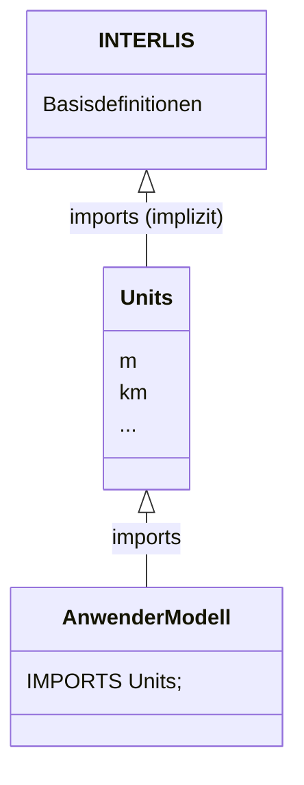

```mermaid
classDiagram
    direction BT
    class INTERLIS{
        Basisdefinitionen
    }
    class Units{
        m
        km
        ...
    }
    class AnwenderModell{
        IMPORTS Units;
    }
    AnwenderModell --|> Units : imports
    Units --|> INTERLIS : imports (implizit)
```